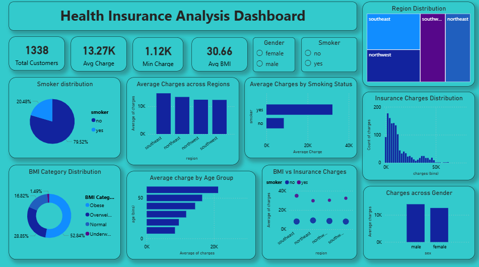

# Medical Insurance Cost Predictor

A Machine Learning web application that predicts an individual's estimated annual medical insurance charges based on demographic and health-related information.

## Live Demo
https://insurance-cost-predictor-debdut-nandy.streamlit.app/

## App UI


## Features

* Predict medical insurance cost instantly
* User-friendly Streamlit interface
* Trained using Random Forest Regression
* Interactive input fields
* Fast and accurate predictions

## Tech Stack

* Python
* Streamlit
* Scikit-learn
* Pandas
* NumPy
* Joblib

## Dataset

The project uses the **Medical Cost Personal Dataset**, which includes the following features:

* Age
* Gender
* BMI
* Number of Children
* Smoking Status
* Region
* Insurance Charges (Target)

## Power BI Dashboard 



## Machine Learning Model

* **Algorithm:** Random Forest Regressor
* **R² Score:** 0.8632

## Run Locally

1. Clone the repository

```bash
git clone https://github.com/your-username/medical-insurance-cost-predictor.git
```

2. Install the required libraries

```bash
pip install -r requirements.txt
```

3. Run the application

```bash
streamlit run app.py
```

## Project Structure

```text
Medical-Insurance-Cost-Predictor/
│
├── app.py
├── insurance_model.pkl
├── model_columns.pkl
├── requirements.txt
├── README.md
└── insurance.csv
```

## Author

**Debdut Nandy**
